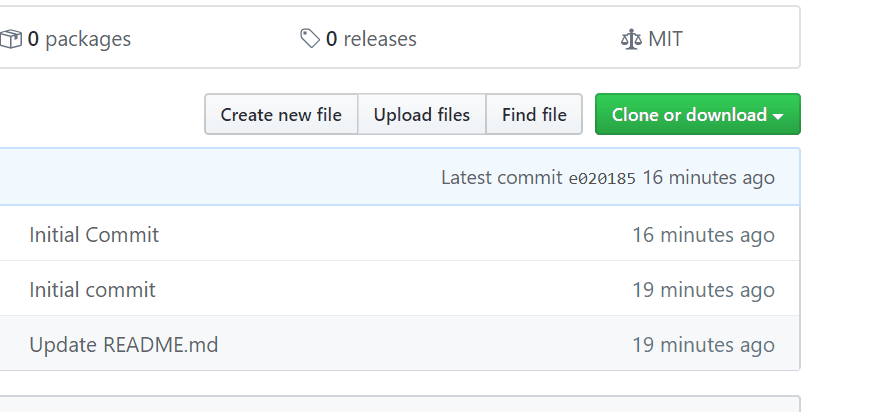
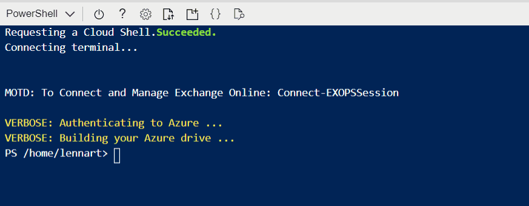

# Azure Spoke Blueprint 
This blueprint creates a fully functional spoke landing zone that can be used by business units. 

## How do I import the blueprint?

1. Download the repository as a zip file:</p>
   
2. Upload zip file via the Azure CloudShell:</p>
   
3. Expand the zipfile using Powershell:</p>
   ```Expand-Archive -Path AzureSpokeBlueprint-master.zip -DestinationPath AzureSpokeBlueprint -force```</p>
4. Change directory into the created folder:</p>
   ```cd ./AzureSpokeBlueprint/AzureSpokeBlueprint-master```</p>
5. Import the blueprint into your management group:</p>
   ```Import-AzBlueprintWithArtifact -Name 'Azure_Spoke_Blueprint' -ManagementGroupId 'xxxxxxxxx-xxxx-xxxxx-xxx-xxxxx-xxxxx' -InputPath ./Azure_Spoke_Blueprint```</p>
