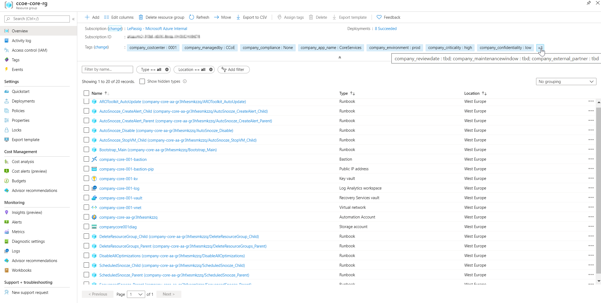

# Azure Spoke Blueprint Version 0.1
This blueprint creates a fully functional spoke landing zone that can be used by business units.

## What is done within this blueprint?

This blueprint allows a zero manual touch deployemnt of a spoke environment. THe blueprint allows the central IT to bootstrap and provide spoke environments to business units.   

### Creation of the following core ```Resources``` within a Spoke-Subscription:

- Resource Group for Core Services/Resources
- Log Analytics Workspace
- Key Vault (Premium)
- Virtual Network (incl. Core Subnet) 
- Recovery Services Vault for Backup and Restore
- Storage Account for Diagnostics
- Azure Automation Account - Configured with the Azure Resource Optimization (ARO) Toolkit (Developed by Microsoft CSEO)
- Sample Resource Group for "App001"
- Resource Group for NetworkWatcher service

### Deployment/Configuration of the following ```Core Settings```:

- Peering to a Hub VNet 
- Send Subscription Activity Logs to Log Analytics
- Activate Security Center "Standard" with Log Analytics Integration
- Deploy Log Analytics Agents for Windows and Linux VMs
- Deploy Dependency Agents for Windows and Linux VMs
- Deploy prerequisites to enable Guest Configuration Policy on Windows and Linux VMs
- Deploy Network Watcher RG and activate the service for the region

### Configuration of the following ```Security Settings```:

- Advanced Threat Protection for Cosmos DB Accounts
- Auditing on SQL servers
- Advanced Threat Protection on Storage Accounts
- Enable Monitoring in Azure Security Center
- Auditing SQL DB transparent data encryption
- Require encryption on Data Lake Store accounts
- Threat Detection on SQL servers
- Deploy Microsoft IaaSAntimalware extension for Windows Servers
- Deploy Advanced Data Security on SQL servers
 
### Highlights: 
- Cross Subscription aware:
  - Cross Subscription VNet Peering for advanced Hub-Spoke scenarios
  - Cross Subscription connection to a central Log Analytics workspace to store ```Activity Logs``` and ```Security Center Data Collection Logs```
- Roll out of Azure Resource Optimization (ARO) Toolkit in Azure Automation (Developed by Microsoft CSEO) for opimized VM Management. 
- Deployment of several Logging and Monitoring agents 

## Prerequisites 
- An Azure ```Hub-Subscription``` that hosts the a Hub-VNet and a region central Log Analytics workspace
- An Azure ```Spoke-Subscription``` that can be used to assigned the blueprint to
- A ```User assigned - Managed Service Identity``` with ```Owner``` permissions on the Spoke-Subscriptions and ```Network Contributor``` as well as ```Log Analytics Contributor``` permissions on the Hub-Subscription

## How do I import the blueprint?

1. Download the repository as a zip file:</p>
   
2. Upload zip file via the Azure CloudShell:</p>
   
3. Expand the zip file using Powershell:</p>
   ```Expand-Archive -Path AzureSpokeBlueprint-master.zip -DestinationPath AzureSpokeBlueprint -force```</p>
4. Change directory into the created folder:</p>
   ```cd ./AzureSpokeBlueprint/AzureSpokeBlueprint-master```</p>
5. Import the blueprint into your management group:</p>
   ```Import-AzBlueprintWithArtifact -Name 'Azure_Spoke_Blueprint' -ManagementGroupId 'xxxxxxxxx-xxxx-xxxxx-xxx-xxxxx-xxxxx' -InputPath ./Azure_Spoke_Blueprint```</p>

## How do I assign the blueprint? 
1. Right-click the imported blueprint draft and select ```Publish blueprint```</p>
2. Enter a version number (e.g. 0.1) and some comments and click ```Publish```</p>
3. Right-click published  blueprint and select ```Assign blueprint```</p>
4. Change the basic settings according to your ```Region``` of choice and for Managed Service Identity select ```User assigned``` as seen below:</p>
   
   </p>
   Note: Change the first field "Subscription" accordingly (if needed)</p>
5. Fill in the central ```Blueprint Parameter``` as needed. These parameters are used by multiple artifacts to and are therefore "Global": </p>
   
6. Fill in the ```Artifact Parameter``` as needed. See the naming pattern below:</p>
- Log Analytics Workspace: ```CompanyPrefix```-core-001-log
- Diagnostics Storage Account: ```CompanyPrefix```core001diag
- Azure Key Vault: ```CompanyPrefix```-core-001-kv 
- Azure Recovery Services Vault: ```CompanyPrefix```-core-001-vault
- Azure VNet: ```CompanyPrefix```-core-001-vnet
- Azure Subnet: ```CompanyPrefix```-core-001-subnet
- Azure Automation Account: ```UniqueString```-aa-automation</p>
7.  Click ```Assign``` to assign the blueprint and begin to bootstrap the ```Spoke-Subscription```

## Deploy in a differnet Region than West Europe

- Change Region of RGs in the blueprint: 
PIC
- CHange AzureRegion in Blueprint Parameters 
- Create new Managed Service Identity  

## What is the result? 

There are two major deployment types that are being . 

1. Deployment of Azure resources:  
</p></p>
2. Deployment of Azure Policies:
</p></p>
